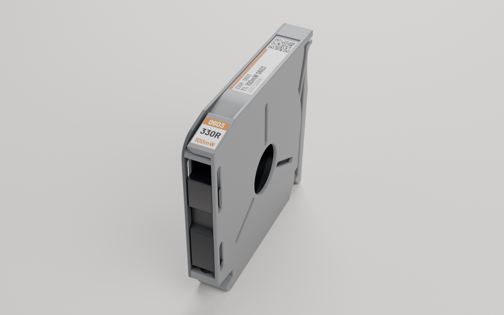
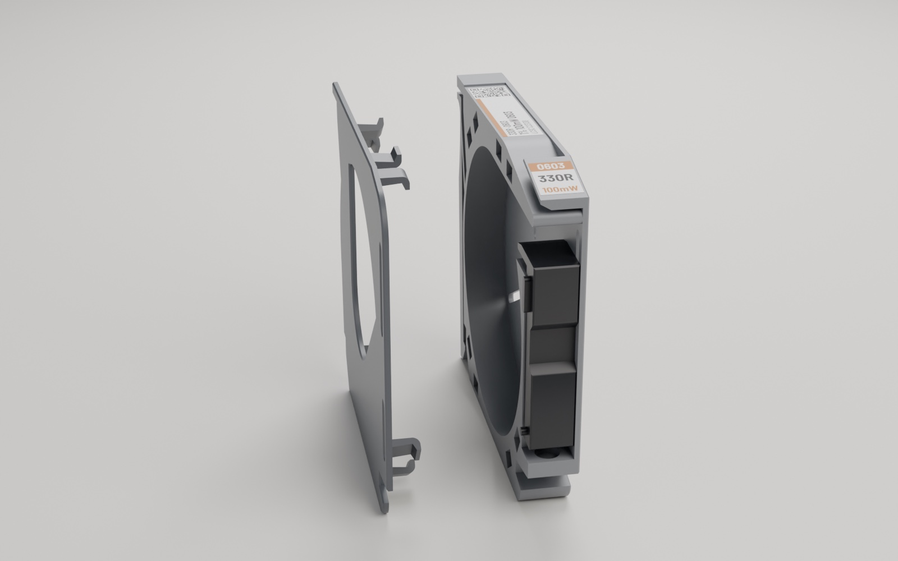

# SMD Tape Magazine: parametric

A fully parametric FreeCAD model of an SMD component tape magazine for 8, 12
and 16 mm tape, plus a sticker generator that prints matching labels for each
magazine.


| 8 mm magazine | lid latches |
|---|---|
|  |  |

## What's in here

| path | what |
|---|---|
| `print/` | print-ready STLs: `smd-magazine-body-{8,12,16}mm`, `smd-magazine-slider-{8,12,16}mm`, `smd-magazine-lid-all-sizes` |
| `print/rails/` | rails to stand the magazines in, from the two earlier versions of this design (their own licenses, see [rails/README](print/rails/README.md)) |
| `cad/smd-tape-magazine.FCStd` | the parametric FreeCAD model (FreeCAD 1.1+): magazine, lid, slider, parameters |
| `cad/latch-socket-cutter.FCStd`, `cad/latch-peg.FCStd` | the lid latch shapes, linked into the main file. Keep all three files together |
| `stickers/` | label generator (work in progress): front + top stickers per part, laid out on A4 |
| `docs/DESIGN.md` | how the model is built, measured dimensions, and known traps |

## Print

**Print in PETG only.** The lid holds on with eight small snap pegs; PLA is
too brittle for them and they snap off.

The STLs are already oriented: the chamfered face goes on the bed (it's there
to absorb elephant's foot). No supports needed.

| setting | value |
|---|---|
| material | PETG |
| nozzle | 0.4 mm |
| layer height | 0.25 mm |
| walls | 3 |
| top / bottom shells | 3 / 3 |
| infill | 8–10% gyroid (a little infill makes the print itself more reliable) |
| supports | none |

**Tune your filament profile first**, especially **bridging and cooling**.
The latch sockets and pegs are small, and sagging bridges or under-cooled
overhangs are the usual cause of a lid that won't fit or won't stay on.

Per magazine: one body, one slider of the same width, one lid, and a spring.
For the rail, pick one from [`print/rails/`](print/rails/README.md).

### Loader (recommended)

Print Robin's [SMD Magazine Loader](https://www.printables.com/model/468303-smd-magazine-loader)
too. It makes refilling a magazine with tape quick and easy. **These
magazines are compatible with it**; the design they were remixed from is not.

### Fitting the lid

Press the lid on **evenly**, with something flat and stiff laid over it, e.g.
a ~3 mm mild steel plate, so all eight pegs snap in together. Pressing one
corner at a time bends the lid and can break a peg.

### Spring

The slider's spring bore is 8 mm deep, made for a longer spring than
upstream's. Upstream's spring is 0.3 mm wire × 4 mm OD × 20 mm with a 5 mm
bore. To use that one, set `spring_pocket` to 5 (see below).

## Customise

Open `cad/smd-tape-magazine.FCStd` in FreeCAD 1.1 or newer and double-click
`Parameters`. The sheet is colour-coded:

- **green: user inputs.** `tape_size` (8 / 12 / 16), `clearance`, `wall`,
  `spring_pocket`
- **yellow: fit tuning.** `peg_gap`: raise it if the lid is too tight to push
  on with your printer
- **grey: derived / internal.** Calculated from the above; don't type over them

After changing a value press **Ctrl+R** (Edit → Refresh). Then select the
`Magazine`, `Lid` or `Slider` body and export it as STL.

## Stickers (work in progress)

`stickers/` generates two labels per part from a CSV parts list: a front
label for the dispensing end and a top strip with value, package and a QR
code, sized to the magazine width.


> **Work in progress.** I've printed and tested a few sheets, but haven't used
> them on a full set of magazines yet. Expect changes.

Print them on **glossy peel-off sticker paper** at your printer's **highest
quality** setting, at 100% scale.

Runs with [uv](https://docs.astral.sh/uv/):

```sh
cd stickers
uv run labels.py example.csv --out out
```

See [`stickers/README.md`](stickers/README.md) for examples, the CSV format
and options.

## Credits

- **Based on** [SMD Component Tape Magazine (8, 12, 16mm)](https://www.printables.com/model/580643)
  by **Lord Asdi**, licensed CC BY 4.0. The body outline was traced from its
  STL and the model rebuilt from scratch as a parametric design, with reworked
  lid latches, sockets and slider.
- **Inspired by** the Gen 2 SMD magazine by **robin7331**, whose original
  *SMD Component Magazines* is the design Lord Asdi's version remixes. Gen 2
  hasn't been released as open source; this is an open, parametric take on the
  same idea.
- **Rails** in `print/rails/` are by Lord Asdi (CC BY 4.0) and
  [OneGeekGuy](https://www.printables.com/model/1182844) (CC BY-NC 4.0),
  included unmodified.

## License

Everything I made here (3D model, STLs, sticker generator, images, docs) is
licensed under [CC BY-NC-SA 4.0](LICENSE):

- **Free** to print, share and remix, with credit
- **No commercial use**: don't sell the files or prints made from them
- **Remixes must use the same license**

Exceptions: the rails in `print/rails/` keep their authors' licenses (see
above), and the fonts in `stickers/fonts/` are under the SIL Open Font
License ([`OFL.txt`](stickers/fonts/OFL.txt)).
