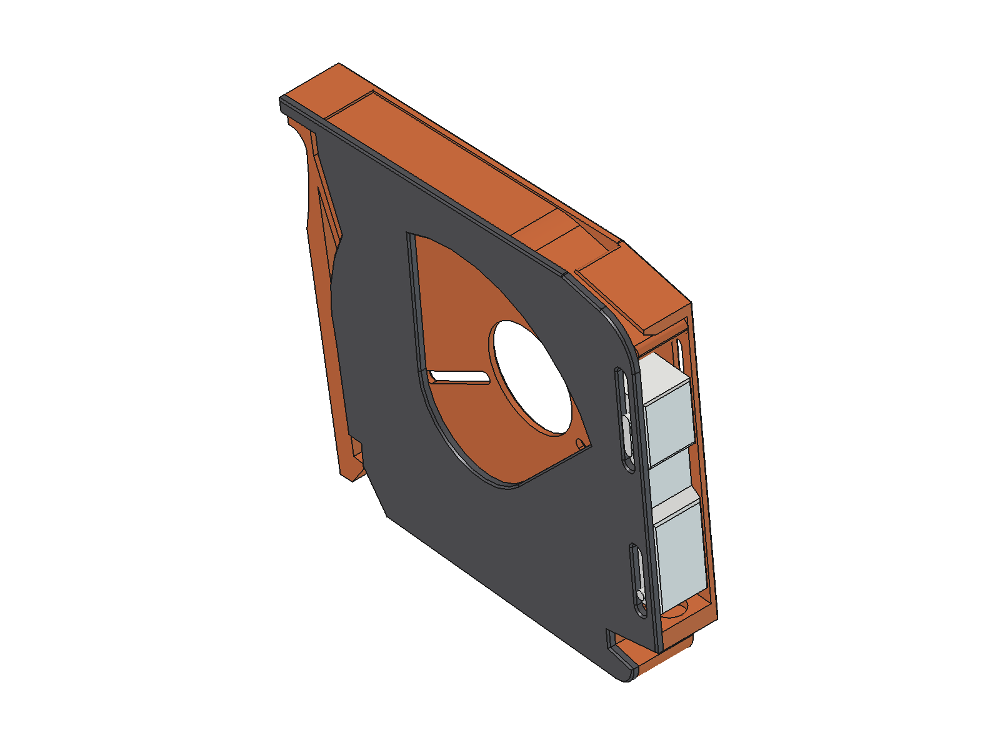
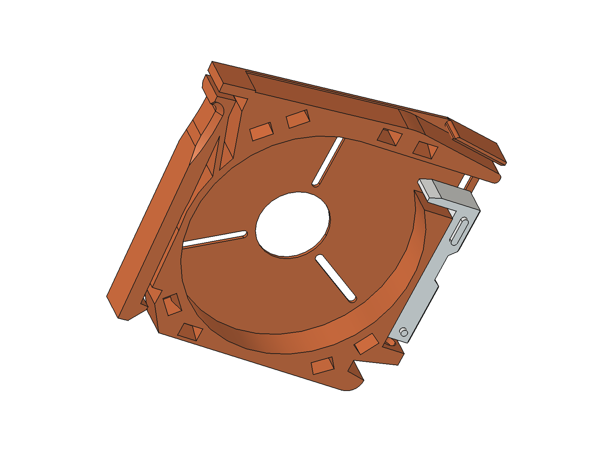

# SMD Tape Magazine: parametric

A fully parametric FreeCAD model of an SMD component tape magazine for 8, 12
and 16 mm tape, plus a sticker generator that prints matching labels for each
magazine.

## What's in here

| path | what |
|---|---|
| `print/` | print-ready STLs: `body_{8,12,16}mm`, `slider_{8,12,16}mm`, `lid` (one lid fits all widths) |
| `cad/` | the parametric FreeCAD model (FreeCAD 1.1+). Keep the three files together |
| `stickers/` | label generator: front + top stickers per part, laid out on A4 |
| `docs/DESIGN.md` | how the model is built, measured dimensions, and known traps |

## Print

**Print in PETG only.** The lid holds on with eight small snap pegs; PLA is
too brittle for them and they snap off.

The STLs are already oriented: the chamfered face goes on the bed (it's there
to absorb elephant's foot). No supports needed.

Settings I print with (0.4 mm nozzle):

| | |
|---|---|
| material | PETG |
| layer height | 0.25 mm (first layer 0.2) |
| walls | 2 |
| top / bottom layers | 4 / 3 |
| infill | 0% |
| supports | none |

Per magazine: one `body`, one `slider` of the same width, one `lid`, and a
spring.

### Spring

The slider's spring bore is 8 mm deep, made for a longer spring than
upstream's. Upstream's spring is 0.3 mm wire × 4 mm OD × 20 mm with a 5 mm
bore. To use that one, set `spring_pocket` to 5 (see below).

## Customise

Open `cad/body.FCStd` in FreeCAD 1.1 or newer and double-click `Params`. The
sheet is colour-coded:

- **green: user inputs.** `tape_size` (8 / 12 / 16), `clearance`, `wall`,
  `spring_pocket`
- **yellow: fit tuning.** `peg_gap`: raise it if the lid is too tight to push
  on with your printer
- **grey: derived / internal.** Calculated from the above; don't type over them

After changing a value press **Ctrl+R** (Edit → Refresh). Then export the tip
of `Body001` (body), `lid` and `slider` as STL.

## Stickers

`stickers/` generates two labels per part from a CSV parts list: a front
label for the dispensing end and a top strip with value, package and a QR
code, sized to the magazine width. See [`stickers/README.md`](stickers/README.md).

## Credits

- **Based on** [SMD Component Tape Magazine (8, 12, 16mm)](https://www.printables.com/model/580643)
  by **Lord Asdi**, licensed CC BY 4.0. The body outline was traced from its
  STL and the model rebuilt from scratch as a parametric design, with reworked
  lid latches, sockets and slider.
- **Inspired by** the Gen 2 SMD magazine by **robin7331**, whose original
  *SMD Component Magazines* is the design Lord Asdi's version remixes. Gen 2
  hasn't been released as open source; this is an open, parametric take on the
  same idea.

## License

- **3D model, STLs, images, docs:** [CC BY-NC-SA 4.0](LICENSE). Free to print,
  share and remix with attribution; not for commercial use; remixes must use
  the same license.
- **Sticker generator code** (`stickers/*.py`): [MIT](stickers/LICENSE).
- **Fonts** in `stickers/fonts/`: SIL Open Font License, see
  [`OFL.txt`](stickers/fonts/OFL.txt).
