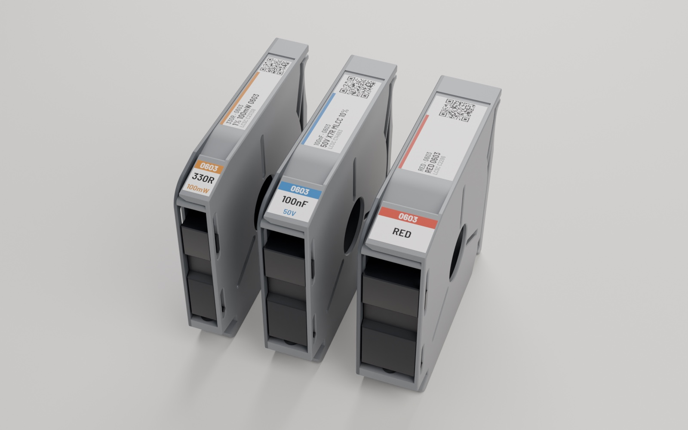
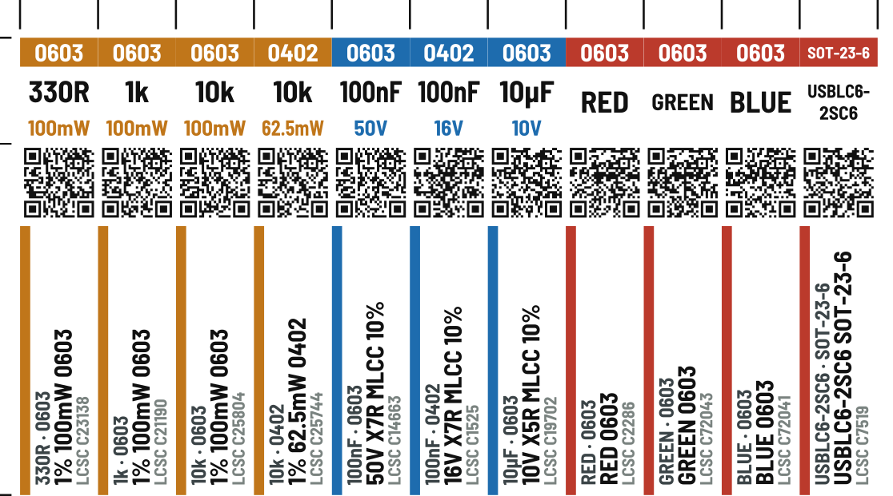
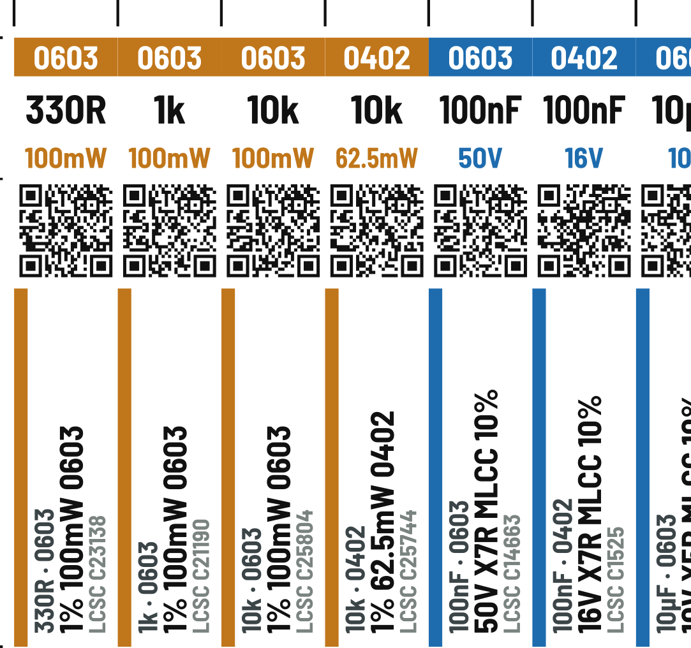
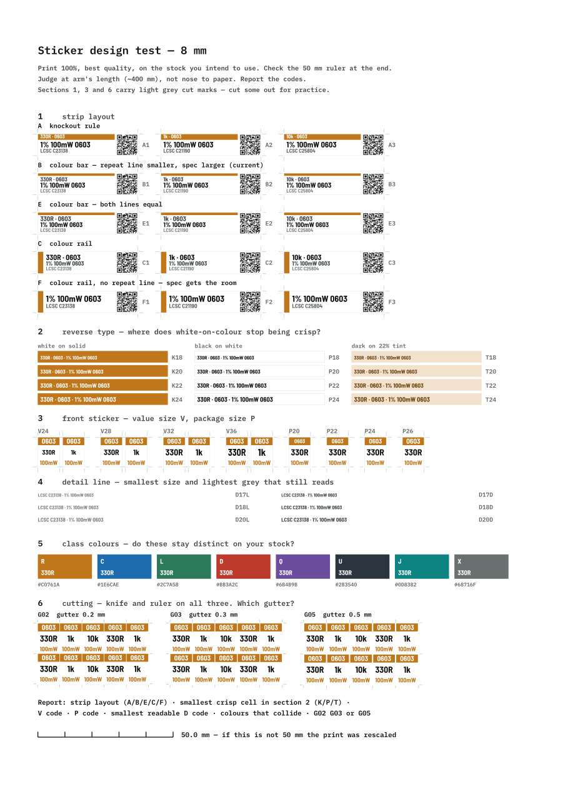

# Magazine stickers

Generates two stickers per part from a parts list, laid out on A4 for cutting
with a knife and a ruler.

| sticker | size | face on the magazine | content |
|---|---|---|---|
| front | `W × 11` | small chamfer at the dispensing end | package, value, qualifier |
| strip | `W × 37` | angled top edge | value·package rule, headline, supplier + qty, QR |

`W` is the tape size (8 / 12 / 16 mm). Both lengths are fixed — only the width
tracks the feeder, which is why the two stickers share a column grid and can be
paired one cell per part.

> **Work in progress.** I've printed and tested a few sheets, but haven't used
> the stickers on a full set of magazines yet. Sizes and layout may change.

**How to print them:**
- Use **glossy sticker paper**, the shiny kind with a backing you peel off.
  Small text and the QR codes stay crisp on it; plain paper blurs them.
- Set the printer to its **highest quality / best detail** setting.
- Print at **100% scale**, never "fit to page". Before cutting, measure the
  outermost cut ticks: `labels.py` prints the distance they must be apart
  (or add `--marks` for a 50 mm ruler on the sheet).



## Examples

An 8 mm sheet made from [`example.csv`](example.csv): real LCSC parts
(resistors, capacitors, LEDs, an ESD diode), colour-coded by class. Each part
gets a front sticker (package band, value, rating) and a top strip (spec, LCSC
part number and a QR that opens the part's LCSC page).



Close-up:



The design test sheet (`design_test_sheet.py`). I printed it on sticker stock
and picked the current sizes from it:



## Run

Needs [uv](https://docs.astral.sh/uv/). It installs Python and the
dependencies on first run.

```sh
uv run labels.py example.csv --out out                 # try it on the bundled example
uv run labels.py parts-template.xlsx --out out         # or fill in the Excel template
uv run labels.py "path/to/parts.csv" --out out --pdf
uv run qr_scan_test_sheet.py "path/to/parts.csv"       # print-and-scan diagnostic
uv run design_test_sheet.py "path/to/parts.csv"        # design experiment sheet
```

Fonts are bundled in `fonts/` (OFL) and text is converted to outlines, so
nothing needs installing and the PDF renders identically anywhere.

## Options

| flag | effect |
|---|---|
| `--feeder 12` | tape width for rows whose `feeder` cell is empty (or with no `feeder` column); 8 is the default |
| `--layout` | how mixed widths share sheets: `page`, `row` or `mixed` (see below). Asked interactively if omitted |
| `--gutter 0.5` | white between stickers; cuts run down its middle |
| `--supplier` | supplier for rows whose `supplier` cell is empty; `LCSC` is the default |
| `--qr-template` | link pattern for those rows, `{sku}` substituted; default is that supplier's built-in pattern |
| `--marks` | add a 50 mm ruler and footer to the sheet |
| `--pdf` | also run `inkscape` to produce PDF |

## Experiment sheet

`design_test_sheet.py` puts every open design question on one sheet (8 mm fits a
single A4; wider tapes flow onto a second page) so they can be settled in one
print. The sample stickers are the first parts in your CSV with the tested
width; `--feeder 12` picks the width (default: the first part's). Each cell is
coded so results can be reported without ambiguity:

| section | codes | question |
|---|---|---|
| 1 | `A1`–`F3` | strip layout: knockout rule, colour bar ×2, colour rail, or rail with no repeat line |
| 2 | `K16`–`K24`, `P`, `T` | reverse type vs positive vs dark-on-tint, 1.6–2.4 mm |
| 3 | `V24`–`V36`, `P20`–`P26` | front sticker value size and package size |
| 4 | `D17L`–`D20D` | detail line: size and grey vs dark |
| 5 | — | do the eight class colours stay distinct on your stock |
| 6 | `G02`, `G03`, `G05` | gutter width — cut all three and see |

Sections 1, 3 and 6 carry light grey corner crop marks so real stickers can be
cut out of the experiment sheet for practice. The marks are `#B9C0BD`, light
enough to cut straight through without leaving a visible edge — cut guides
belong outside the artwork, and never in black next to it.

Reverse type is the hard case: ink spreads into white strokes and thins them, so
white-on-colour fails at a larger size than black-on-white. Section 2 finds where.

## Type — settled by print test

Sizes are not theoretical; they were chosen off a printed experiment sheet
(glossy sticker stock, MP tray, best quality) and are fixed constants in
`labels.py`. Strings that will not fit are demoted individually by `_fit_step`
rather than shrinking every sticker on the sheet.

| what | size | experiment code |
|---|---|---|
| front value | 3.2 mm | V32 |
| front package | 2.6 mm | P26 |
| front qualifier | 2.3 mm | — |
| strip line 1 (repeat) | 2.15 mm | layout B |
| strip line 2 (spec) | 2.6 mm | layout B |
| strip detail | 1.85 mm light grey | D18L, floor D17L |

**Strip layout B**: a plain colour bar with every character on white. Line 1
repeats the front sticker so it is demoted and greyed; line 2 is the spec, the
only thing the strip says that the front sticker does not.

Reverse type tested fine on glossy stock, which is why the front sticker's
package band is still white on solid colour. On plain paper it was the weakest
element on the sheet — the stock, not the design, was the problem.

## Cutting and bleed

`--gutter` (default 0.25 mm) sets the gap between stickers and the cut runs down
its middle, so every boundary is still a single straight full-sheet cut.

The gap is **not white**. Each sticker's edge colour is extended by half the
gutter, so the two bleeds meet exactly on the cut line. A cut that drifts then
shows colour rather than a white sliver, which is what reads as a printing
fault. Because the parts list is grouped by class, most neighbours share a
colour and most cut lines are invisible; only a class change leaves a two-colour
seam, and drifting there picks up the neighbour's hue rather than white.

The QR needs no special handling. Nothing coloured is allowed within 0.8 mm of
it, so its bleed is white — which is exactly what a quiet zone is. The 0.3 mm
quiet zone at the trim line only grows if the cut drifts outward. Long ticks mark cell edges, short ticks the split between a
part's front sticker and its strip.

## Input

A spreadsheet (`.xlsx`) or a CSV with a header row.

**Easiest: fill in [`parts-template.xlsx`](parts-template.xlsx)** in Excel,
LibreOffice or Google Sheets. It has dropdowns for `kind`, `feeder`,
`tolerance` and `footprint`, a note on every column header, and highlights a
row that has a `kind` but no `value` (or the reverse). Values outside the
dropdowns are allowed; you only get a warning. `labels.py` reads its `parts`
sheet directly (or the first sheet of any other workbook). The template is
built by `make_template.py` from `example.csv`.

Columns are matched **by name**, in any order and any case; only `kind` and
`value` are required:

| column | example | notes |
|---|---|---|
| `kind` | `R`, `C`, `LED`, `IC` | picks the class colour (see below) |
| `value` | `330`, `100n`, `USBLC6-2SC6` | long values wrap onto two lines at a space or hyphen. A value that still does not fit stops the run with an error naming the row; nothing is ever printed shortened |
| `tolerance` | `1%` | |
| `rating` | `100m`, `50v X7R` | power for resistors, voltage/dielectric for caps |
| `subtype` | `MLCC` | |
| `footprint` | `0603` | also accepted as `package` |
| `supplier` | `LCSC`, `DigiKey`, `Mouser`, `Robu` | who the `sku` belongs to; decides the QR link (see QR below). Empty = `--supplier` (LCSC) |
| `sku` | `C23138`, `497-5235-1-ND` | supplier part number; printed on the strip, and used to build the QR link |
| `url` | `robu.in/?s=R178998&post_type=product` | full product link for the QR. Needed for suppliers without a built-in link; overrides it for the others |
| `quantity` | `21-30` | for your own stock keeping. **Never printed** on the sticker: a count goes stale, the sticker doesn't |
| `feeder` | `8`, `12`, `12mm` | tape width in mm, any value; empty uses `--feeder` |

Unknown columns are ignored (and listed as a warning). A header name that
appears twice is an error, so a column is never picked by guesswork.

`kind` maps to a class (R C L D Q U J X) which picks the colour and decides the
strip headline: passives lead with their spec, semiconductors lead with the part
number. Values are normalised on the way in — `100n` → `100nF`, `330` → `330R`.

Each row can come from a different supplier. The strip shows the supplier name
and `sku` (e.g. `LCSC C23138`), and the QR opens that part's page:

| `supplier` | QR link built from `sku` |
|---|---|
| LCSC (or empty) | `lcsc.com/product-detail/{sku}.html` |
| DigiKey | `digikey.com/en/products/result?keywords={sku}` |
| Mouser | `mouser.com/ProductDetail/{sku}` |
| anything else | none: put the full link in `url` (otherwise a warning, and no QR) |

Each pattern was checked by opening a real part in a browser. Links carry no
`https://` or `www.`: every character makes the QR denser, and the browser adds
them. Some camera apps show a scheme-less link as plain text, so check yours with
`qr_scan_test_sheet.py` (section 3 prints it with and without `https://`).

## Mixed tape widths

Every sticker is the same height; only its width follows the part's `feeder`.
When a CSV has more than one width, `labels.py` asks how they should share
sheets (or pass `--layout`):

| layout | what you get | cutting |
|---|---|---|
| `page` | one width per page | as usual: every column lines up down the whole sheet |
| `row` | rows may differ, a row never mixes widths | each row has its own column ticks, in the gap above and below it |
| `mixed` | any widths side by side; tightest packing | same as `row` |

For `row` and `mixed`, parts stay in **CSV order** whenever that costs no extra
rows; otherwise they are reordered to pack tighter, and the summary says which.
Rows are 8 mm apart to hold their ticks, so a page holds 4 rows instead of 5.
Cut with the sheet intact (through the sticker layer, not the backing) so every
tick stays usable.

## QR

Payload length decides the symbol version, version decides the module count, and
module count decides whether it survives printing. The strip width is a hard
ceiling on the box, because a QR is square and cannot use the 37 mm length.

Measured on an inkjet, normal quality, plain paper, iOS camera:

| module size | result |
|---|---|
| 0.336 mm (8.4 mm box, 29 mod) | scanned |
| 0.269 mm (7.8 mm box, 29 mod) | did not scan |
| 0.248 mm (7.2 mm box, 29 mod) | scanned only with effort |

Working floor at normal quality on plain paper is roughly **0.29 mm per
module**. An 8 mm strip gives a 7.4 mm box, and the LCSC link is 35 bytes, which
is a version 3 symbol: **0.255 mm**. That is below the plain-paper floor; it
relies on best quality on glossy sticker stock.

### The QR warning

`labels.py` works out every part's module size (its link length and its tape
width) and prints a loud **QR WARNING** for any below **0.25 mm**
(`QR_MIN_MODULE`), i.e. anything denser than the LCSC default on 8 mm. This is
a guard against links *worse* than what has been printed, not a guarantee: run
`qr_scan_test_sheet.py` on your printer and stock. A link too long for any QR
at all stops the run.

| link on 8 mm tape | chars | mm/module | |
|---|---|---|---|
| LCSC | 35 | 0.255 | ok |
| Mouser | 40 | 0.255 | ok |
| DigiKey | 53 | 0.255 | ok, but at the limit: a part number over 13 characters tips it into a denser code (0.224, warning) |

**The URL cannot get much shorter.** `lcsc.com` without `www` already redirects,
and version 2 holds only 32 bytes at ECC L. Uppercasing the URL would switch it
to the denser alphanumeric mode, but LCSC's path is case-sensitive: an
uppercase path lands on the catalogue page, not the part.

### If 0.255 mm will not scan

The one remaining lever is a short redirect on a host you own. A path-style URL
in uppercase stays in alphanumeric mode and holds version 1:

| payload | chars | version | mm/module @ 7.4 |
|---|---|---|---|
| `lcsc.com/product-detail/C23138.html` | 35 | 3 | 0.255 |
| `HTTP://EXAMPLE.SH/C23138` | 24 | 1 | **0.352** |

That is a 38% larger module in the same box — comfortably past your floor.

A Cloudflare Worker is enough:

```js
export default {
  fetch(request) {
    const sku = new URL(request.url).pathname.slice(1).toUpperCase();
    if (!sku) return new Response("no sku", { status: 404 });
    return Response.redirect(
      `https://lcsc.com/product-detail/${sku}.html`, 301);   // a redirect needs the full URL
  },
};
```

Point a short domain at it, then generate with:

```sh
uv run labels.py parts.csv --qr-template "HTTP://EXAMPLE.SH/{sku}"
```

Uppercase in the template is deliberate and required — one lowercase character
drops the payload into byte mode and costs you the version 1 symbol. Scheme and
host are case-insensitive so the link still resolves. Verify that your scanner
linkifies the uppercase form before committing a sheet.

## Printing

Print at 100%, best/high quality, on glossy sticker paper. Check the scale
before committing sticker paper: `labels.py` prints how far apart the outermost
cut ticks must be, or add `--marks` for a 50 mm ruler.

Cut ticks sit in the margins, never on a sticker. Long ticks are cell edges,
short ticks the split between a part's front sticker and its strip.

Content is kept 20 mm clear of the trailing edge (`MARGIN_Y`, `FOOTER_Y`),
because that is the margin inkjets clip.
